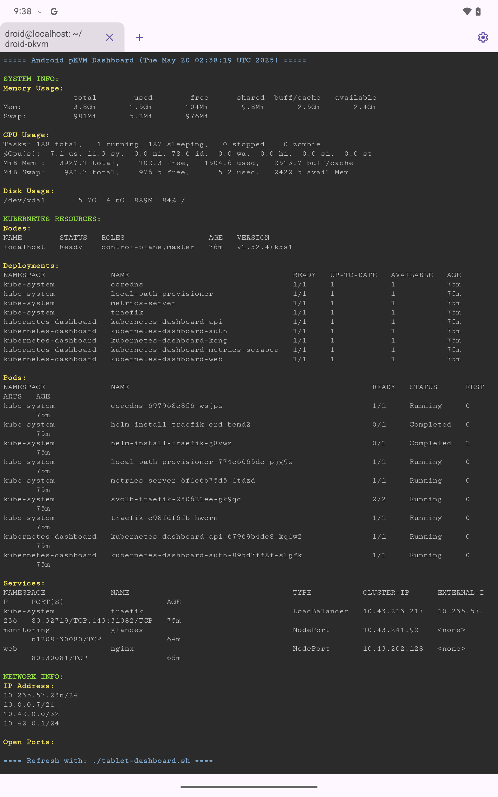

# Android pKVM

A toolkit for deploying Debian VMs on Android devices with _pKVM_ ([protected Kernel Virtual Machine](https://source.android.com/docs/core/virtualization/security#hypervisor)) support. This project demonstrates how to leverage Android's hypervisor capabilities to run fully featured Linux environments with Kubernetes.

<div align="center">
  <table>
    <tr>
      <td width="43%"><strong>Web</strong> (from VPN)</td>
      <td width="57%"><strong>Terminal</strong> (from pKVM)</td>
    </tr>
    <tr>
      <td></td>
      <td></td>
    </tr>
  </table>
</div>

> Note: run `./tablet-dashboard.sh` for a real-time terminal view of system metrics.

## Enabling pKVM on Android

Before using this toolkit, you need to enable the pKVM feature on your Android device:

1. **(Recommended for stability)** Flash the latest Android 16 release by downloading and flashing the image from [Android 16 download page](https://developer.android.com/about/versions/16/download). Note: Android 16 is still in beta as of May 19th, 2025.

2. **Enable Developer Options** by going to Settings > About phone and tapping the build number 7 times.

3. **Enable USB Debugging** in the newly available Developer Options menu.

4. **Toggle Linux Terminal** (experimental) in Developer Options. This enables the pKVM functionality.

5. **Launch Linux Terminal** app from your app drawer and follow the initial setup prompts.

## Setup

### 1. Bootstrap

```bash
# On the pKVM instance
curl -O https://raw.githubusercontent.com/terranblake/droid-pkvm/main/bootstrap.sh \
  && chmod +x bootstrap.sh \
  && ./bootstrap.sh
```
> Note: i found it easiest to just send myself a message and copy that into the vm; using the on-screen keyboard is not recommended

### 2. Setup

```bash
# Transfer your SSH key to the VM
scp -P 2222 ~/.ssh/id_ed25519.pub droid@<vm-ip>:~/my_key.pub

# On the VM, run setup
cd ~/droid-pkvm && sudo ./setup.sh ~/my_key.pub
```

### 3. Access

```bash
# Remote SSH access
ssh -i ~/.ssh/your_key -p 2222 droid@<vm-ip>
```
> Note: there's additional setup required if you wanted to expose your phone/tablet to the interwebs. Not recommended.

## Features

- Android environment detection
- Optional WireGuard VPN integration
- SSH hardening with key-based authentication
- Kubernetes (k3s) deployment
- Web-based monitoring dashboards

## Documentation

- [Testing](static/markdown/TESTING.md) - Detailed testing procedures and troubleshooting
- [Charts](charts/) - Helm charts for deployed services

## Conclusions

- **Host Device VPN**: If you intend to use a pKVM on your phone, or a device where a VPN connection is required, you will likely encounter issues. During testing we consistently encountered issues where the host being connected to a VPN, even if the VM itself wasn't, would prevent Linux Terminal from booting. This is the reason for the tunnel being initiated from within the VM.

- **VM Stability**: The VM stability can be inconsistent. Occasionally, the Android OS unmounts the VM filesystem and refuses to remount it. This requires resetting the "Linux Terminal" app, erasing the entire OS. This repository was built to be idempotent, so it will help with that. In general, if you're seeing the "Preparing terminal" for longer than a minute, use the "Reset to initial version" option in settings and start over at bootstrapping.

- **Host Performance**: Host devices operate normally while the VM is running, with no unintended restarts. Testing was primarily done on a Pixel Tablet. Storage remains contained within the VM unless external mount points are explicitly defined.

- **Resource Allocation**: 
  - Android 16+ can dedicate almost the entire storage space to the VM
  - Android 16 specifically allocates 4GB of RAM (out of 8GB) to the VM

- **Limitations**: The "Linux Terminal" app, while clean, lacks options for configuring base images or using custom images.

## Disclaimer

use this project at your own risk. flashing your device will erase everything, no questions asked. if you need help, open an issue or pr and i'd be happy to help within the scope and very limited knowledge i have of software.

## License

MIT i guess. go ahead and use this for anything you desire, in perpetuity; no strings attached.
