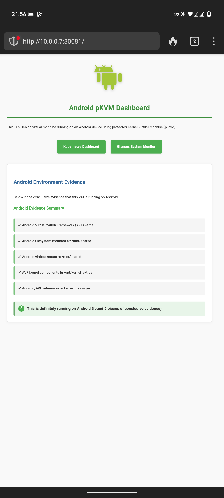

# Android pKVM Setup

A toolkit for deploying Debian VMs on Android devices with pKVM (protected Kernel Virtual Machine) support. This project demonstrates how to leverage Android's hypervisor capabilities to run fully featured Linux environments with Kubernetes.

## Dashboard Views

**Web Dashboard:**  


**Terminal Dashboard:**  
Run `./tablet-dashboard.sh` for a real-time terminal view of system metrics.

## Enabling pKVM on Android

Before using this toolkit, you need to enable the pKVM feature on your Android device:

1. **(Recommended for stability)** Flash the latest Android 16 release by downloading and flashing the image from [Android 16 download page](https://developer.android.com/about/versions/16/download). Note: Android 16 is still in beta as of May 19th, 2025.

2. **Enable Developer Options** by going to Settings > About phone and tapping the build number 7 times.

3. **Enable USB Debugging** in the newly available Developer Options menu.

4. **Toggle Linux Terminal** (experimental) in Developer Options. This enables the pKVM functionality.

5. **Launch Linux Terminal** app from your app drawer and follow the initial setup prompts.

## Quick Setup

### 1. Bootstrap the VM

```bash
# On the pKVM instance
curl -O https://raw.githubusercontent.com/terranblake/droid-pkvm/main/bootstrap.sh
chmod +x bootstrap.sh
./bootstrap.sh [wg_server_ip] [wg_server_pubkey] [wg_client_pubkey] [wg_client_privkey]
```

### 2. Configure Services

```bash
# Transfer your SSH key to the VM
scp -P 2222 ~/.ssh/id_ed25519.pub droid@<vm-ip>:~/my_key.pub

# On the VM, run setup
cd ~/droid-pkvm
sudo ./setup.sh ~/my_key.pub
```

### 3. Access

```bash
# Remote SSH access
ssh -i ~/.ssh/your_key -p 2222 droid@<vm-ip>

# Web interfaces (default ports)
Kubernetes Dashboard: http://<vm-ip>:30443
System Monitor (Glances): http://<vm-ip>:8080
Hardware Info: http://<vm-ip>:30081
```

## Features

- Android environment detection
- Optional WireGuard VPN integration
- SSH hardening with key-based authentication
- Kubernetes (k3s) deployment
- Web-based monitoring dashboards

## Documentation

- [Testing Guide](TESTING.md) - Detailed testing procedures and troubleshooting
- [Charts](charts/) - Helm charts for deployed services

## Conclusions

After experimenting with Android pKVM instances, we've observed several key findings:

- **VM Stability**: The VM stability can be inconsistent. Occasionally, the Android OS unmounts the VM filesystem and refuses to remount it. This requires resetting the "Linux Terminal" app, erasing the entire OS. This repository mitigates this issue by providing a quick bootstrap process.

- **Host Performance**: Host devices operate normally while the VM is running, with no unintended restarts. Testing was primarily done on a Pixel Tablet. Storage remains contained within the VM unless external mount points are explicitly defined.

- **Resource Allocation**: 
  - Android 16+ can dedicate almost the entire storage space to the VM
  - Android 16 specifically allocates 4GB of RAM (out of 8GB) to the VM

- **Limitations**: The "Linux Terminal" app, while clean, lacks options for configuring base images or using custom images.

## License

MIT 